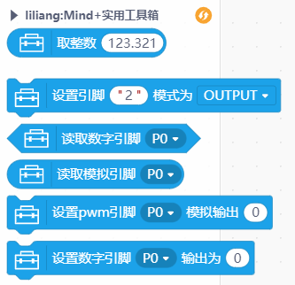
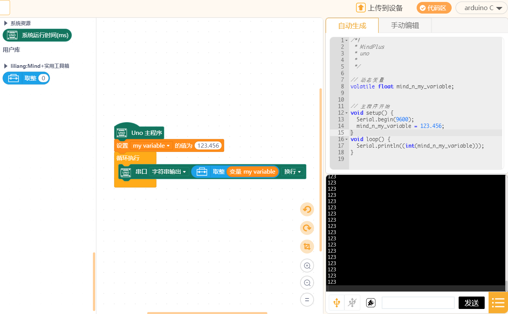

# toolbox 实用工具箱


---------------------------------------------------------

## Table of Contents

* [URL](#url)
* [Summary](#summary)
* [Blocks](#blocks)
* [License](#license)
* [Supported targets](#Supportedtargets)

## URL
* Project URL : ```https://github.com/liliang9693/ext-toolbox```

* Tutorial URL : ```https://mindplus.dfrobot.com.cn/extensions-user```


## Summary
Mind+实用工具扩展，将添加各种常用的功能，例如取整数，引脚输入框，进制转换等

## Blocks




## Examples



## License

MIT

## Supported targets

MCU                | JavaScript    | Arduino   | MicroPython    | Remarks
------------------ | :----------: | :----------: | :---------: | -----
arduino        |             |        √      |             | 
micro:bit        |             |       √       |             | 
mpython        |             |        √      |             | 


## Release Logs
* V0.0.1  取整功能
* V0.0.2  增加引脚下拉输入功能
